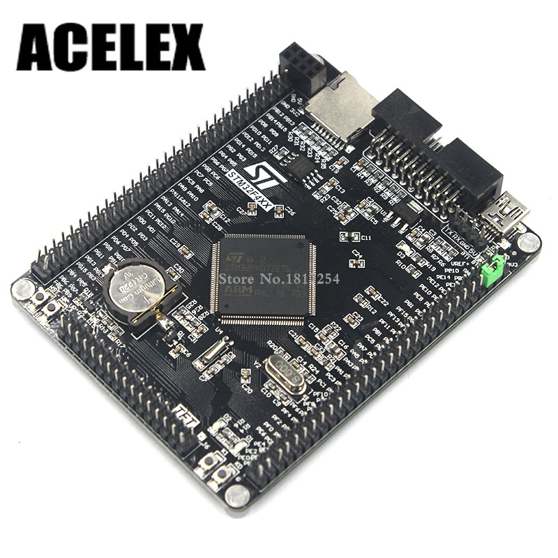
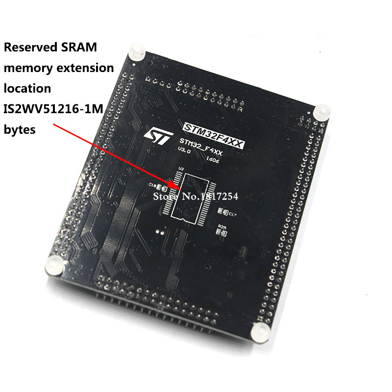

# Black STM32F407ZGT6

MicroPython board definition files for the black STM32F407ZGT6 dev board.

**Brand:** ACELEX (unlabeled)

**Markings:** STM32F4XX STM32_F4VE V3.0 1606

**Note:** this is a variant of the [BLACK STM32F407ZET6] board. This board has a
**STM32F407ZG** MCU instead of a STM32F407ZE and 1024 Kb of flash memory
instead of 512 Kb.






You can buy one for around $16 USD (Dec 2017) on [AliExpress].

### Build and deploy the firmware:

* Clone the board definitions to your [MicroPython](https://github.com/micropython/micropython)
  `ports/stm32/boards` folder.

```
cd micropython/ports/stm32/boards
git clone https://github.com/SpotlightKid/BLACK_F407ZG.git
```

* Disconnect the board from USB
* Set BOOT0 jumper to ON (BT0->3V3)
* Connect the board via USB

**Warning:** The location of the BOOT0 pin is different to where it is located
on older, similar boards, e.g. the [BLACK STM32F407VET6]. It is now the second
pin from the top on the *outer* row on the right side of the board when looking
from above and with the USB connector at the top.

```
cd micropython/ports/stm32
make BOARD=BLACK_F407ZG
make BOARD=BLACK_F407ZG deploy
```

* Disconnect the board from USB
* Set BOOT0 jumper to OFF (BT0->GND)
* Connect the board via USB

```
$ screen /dev/ttyACM0
```

### Specifications:

* STM32F407ZGT6 ARM Cortex M4
* 168 MHz, 210 DMIPS / 1.25 DMIPS / MHz
* 1.8V - 3.6V operating voltage
* 8 MHz system crystal
* 32.768 KHz RTC crystal
* 2.54 mm pitch pins
* JTAG/SWD header
* 1024 Kb Flash, 192 + 4 Kb SRAM
* 3x SPI, 3x USART, 2x UART, 2x I2S, 3x I2C
* 1x FSMC, 1x SDIO, 2x CAN
* 1x USB 2.0 FS / HS controller (with dedicated DMA)
* 1x USB HS ULPI (for external USB HS PHY)
* Micro SD
* Winbond W25Q16 16Mbit SPI Flash
* RTC battery CR1220
* 1x 10/100 Ethernet MAC
* 1x 8 to 12-bit Parallel Camera interface
* 3x ADC (12-bit / 16-channel)
* 2x DAC (12-bit)
* 12x general timers, 2x advanced timers
* AMS1117-3.3V: 3.3 V LDO voltage regulator, max current 800 mA
* Micro USB for power and comms
* Red user LED D1 (PF9) active low
* Red user LED D2 (PF10) active low
* Red power LED D3
* 2x jumper for bootloader selection (only one jumper provided)
* Reset button, Wakeup button, 2x user buttons K0 (PE4) and K1 (PE3)
* 2x30 side pins + 2x16 bottom pins + 1x4 ISP pins
* 2x16 FMSC LCD Interface
* NRF24L01 socket
* M3 mounting holes
* Dimensions: 95.1 mm x 74.6 mm


### Links:

* [STM32F407ZG on st.com](http://www.st.com/content/st_com/en/products/microcontrollers/stm32-32-bit-arm-cortex-mcus/stm32-high-performance-mcus/stm32f4-series/stm32f407-417/stm32f407zg.html)
* Buy on [AliExpress] or search for "STM32F407ZGT6 development board"
* [STM32F407ZG datasheet](http://www.st.com/resource/en/datasheet/stm32f407zg.pdf)
* [STM32F407ZGT6 board dimensions](https://github.com/SpotlightKid/BLACK_F407ZG/blob/master/docs/STM32F407ZGT6_board_dimensions.jpg)
* [STM32F407ZGT6 board schematics](https://github.com/SpotlightKid/BLACK_F407ZG/blob/master/docs/STM32F407ZGT6_board_schematics.jpg)


[AliExpress]: https://www.aliexpress.com/item/Arm-development-board-Cortex-M4-STM32F407ZGT6-development-board-M4-STM32F4-core-board/32826108064.html
[BLACK STM32F407VET6]: https://github.com/mcauser/BLACK_F407VE
[BLACK STM32F407ZET6]: https://github.com/mcauser/BLACK_F407ZE
